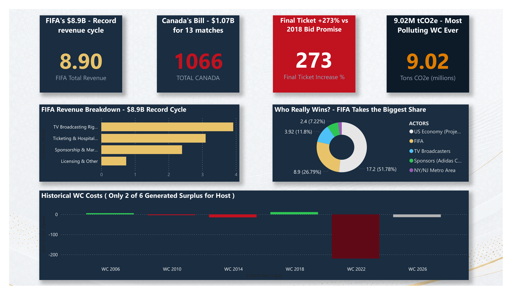
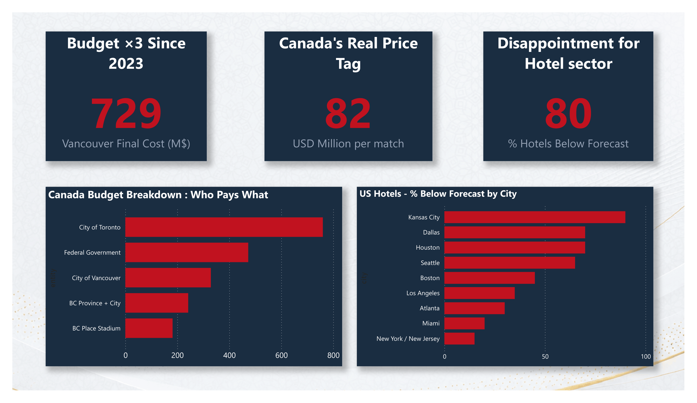

# 🏟️ WC2026 — Economic Impact Analysis


> **"They demand, you deliver. Take it or leave it."**
> — Anonymous source, Radio-Canada Enquête investigation into FIFA's secret contracts with Canada (March 2026)

---

## 📌 Project Overview

FIFA projected **$80.1 billion** in gross economic output for the 2026 World Cup.

This project challenges that narrative with verified data — breaking down the real costs, the real winners, and the environmental price tag of the most ambitious World Cup in history.

**Central question:** *Who really pays — and who really profits?*

**Key angle:** Promises vs. Reality — from FIFA's record $8.9B revenue cycle to Vancouver's budget exploding ×3, from 80% of US hotels underperforming to the most carbon-intensive World Cup ever recorded.

**Important methodological note:** This analysis focuses on measurable economic and environmental costs. It does not fully capture long-term ROI, soft power gains, sports development legacy, or cultural impact — all of which are real but harder to quantify (see Qatar 2022 as a reference case).

---

## 📊 Dashboard Structure — 3 Pages

### Page 1 — Big Picture
*"FIFA wins. Who else?"*

| Visual | Description |
|--------|-------------|
| KPI Card | FIFA Total Revenue — **$8.9B** (record cycle) |
| KPI Card | Canada Total Bill — **$1.07B** for 13 matches |
| KPI Card | Final Ticket Price — **+273%** vs 2018 bid promise |
| KPI Card | Carbon Emissions — **9.02M tCO2e** |
| Bar Chart | FIFA Revenue Breakdown (TV / Ticketing / Sponsorship / Licensing) |
| Donut Chart | Who Really Wins? — Winners by USD value |
| Column Chart | Historical WC Costs 2006→2026 (surplus vs deficit by edition) |

---

### Page 2 — Ground Level
*"The real bill."*

| Visual | Description |
|--------|-------------|
| KPI Card | Vancouver Final Cost — **$729M** (budget ×3 since 2023) |
| KPI Card | Cost Per Match — **$82M** per game (Canada) |
| KPI Card | US Hotels — **80%** below initial booking forecast |
| Bar Chart | Canada Budget Breakdown by Entity (who pays what) |
| Bar Chart | US Hotels % Below Forecast by City (Kansas City ~90% → NY/NJ ~15%) |

---

### Page 3 — Climate Cost
*"The most polluting World Cup ever."*

| Visual | Description |
|--------|-------------|
| KPI Card | Total Emissions — **9.02M tCO2e** |
| KPI Card | Air Travel Share — **85%** of total emissions |
| KPI Card | Cars Equivalent — **6.5M** cars driven a full year |
| Line Chart | Carbon Emissions Timeline 2010→2034 (historical + projections) |
| Card | WC2026 = **×2** vs 2010–2022 average editions |
| Card | FIFA–Aramco Deal — **+30M tCO2e** additional (induced fossil fuel sales) |

---

## 🔑 Key Data Points

### 💰 FIFA Revenue
| Metric | Value | Source |
|--------|-------|--------|
| Total FIFA WC Revenue | **$8.9B** | FIFA Annual Report / Business Standard |
| TV Broadcasting Rights | **$3.92B** | FIFA Publications |
| Ticketing & Hospitality | **$3.1B** | FIFA Annual Report |
| Sponsorship & Marketing | **$2.4B** | Ampere Analysis / SportsPro |
| Total 2023–2026 Cycle | **$13B** | FIFA Revised Budget |

### 🍁 Canada — The Real Cost
| Metric | Value | Source |
|--------|-------|--------|
| Vancouver initial budget (2023) | $230M | BC Government |
| Vancouver final cost (2026) | **$729M** | The Mercury News / BC Gov |
| Budget increase | **×3 (+217%)** | Parliamentary Budget Officer |
| Toronto total cost | $380M | BudgetTO 2026 |
| Federal government contribution | $473M | PBO May 2026 |
| **Canada total** | **$1.066B** | **Parliamentary Budget Officer** |
| Cost per match | **$82M** | PBO / CBC |

### 🎟️ Ticket Prices — Promise vs Reality
| Round | Promised (2018 Bid) | Reality (2026) | Increase |
|-------|---------------------|----------------|----------|
| Final (cheapest seat) | $1,550 | $5,785 | **+273%** |
| Final (top category) | — | $32,970 | — |
| Group stage (min) | — | $60 | — |
| Tickets unsold 2 days before KO | — | **180,000** | — |

### 🏨 US Hotels Performance
| City | % Below Forecast | Status |
|------|-----------------|--------|
| Kansas City | ~90% | 🔴 Critical |
| Dallas & Houston | ~70% | 🔴 Poor |
| Seattle | ~65% | 🔴 Poor |
| Boston | ~45% | 🟠 Moderate |
| Atlanta | ~30% | 🟡 Acceptable |
| Miami | ~20% | 🟡 Acceptable |
| New York / NJ | ~15% | 🟢 Good |
| **Average all cities** | **80%** | **🔴 Poor** |

### 🌍 Carbon Emissions
| Metric | Value | Source |
|--------|-------|--------|
| Total emissions WC2026 | **9.02M tCO2e** | SGR / EDF |
| Air travel share | **85%** (7.72M tCO2e) | SGR 2025 |
| vs 2010–2022 average | **×2** | SGR Report |
| vs Qatar 2022 (5.25M) | **+72%** | SGR / Britannica |
| Cars equivalent | **6.5M cars/year** | SGR / EDF |
| FIFA–Aramco additional | **+30M tCO2e** | Cool Down / EDF |

### 🏆 Historical WC — Host Country Result
| Year | Host | Cost (USD B) | Result |
|------|------|-------------|--------|
| 2006 | Germany | $6.2B | ✅ Surplus |
| 2010 | South Africa | $3.9B | ❌ Deficit |
| 2014 | Brazil | $15B | ❌ Deficit |
| 2018 | Russia | $11.6B | ✅ Surplus |
| 2022 | Qatar | $220B | ❌ Deficit |
| 2026 | USA / Canada / Mexico | ~$13.9B | ⏳ TBD |

> **Only 2 of 6 recent World Cups generated a surplus for the host country.**
> *(Source: Michigan Journal of Economics / The Ball Business)*

---

## 🖼️ Dashboard Screenshots

### Page 1 — Big Picture


### Page 2 — Ground Level


### Page 3 — Climate Cost


> 📁 Add your screenshots in the `/screenshots` folder

---

## 📁 Repository Structure

```
WC2026-Economic-Impact-Analysis/
│
├── data/
│   ├── 01_fifa_revenue.csv
│   ├── 02_canada_budget.csv
│   ├── 03_ticket_prices.csv
│   ├── 04_historical_wc_costs.csv
│   ├── 05_winners_losers.csv
│   ├── 06_us_hotels.csv
│   └── 07_carbon_emissions.csv
│
├── dashboard/
│   └── WC2026_Economic_Impact.pbix
│
├── screenshots/
│   ├── page1_big_picture.png
│   ├── page2_ground_level.png
│   └── page3_climate_cost.png
│
└── README.md
```

---

## 🔬 Methodology & Limitations

**Data sources:** All figures sourced from official reports, government documents, and verified investigative journalism. Each data point includes its source in the CSV files.

**Key methodological note:**
This analysis captures **measurable short-term economic and environmental costs**. It intentionally excludes:
- Long-term infrastructure legacy value
- Soft power and geopolitical gains (cf. Qatar 2022)
- Sports development and grassroots impact
- Cultural and tourism spillover effects beyond the event window

These dimensions are real and significant — but resist simple quantification. A complete ROI analysis would require a 10–15 year post-event study.

**Data reliability:**
- 🟢 **High confidence:** FIFA revenue, PBO Canada figures, AHLA hotel data, SGR emissions
- 🟡 **Estimated:** US hotel % by city (order of magnitude, not official figures)
- 🟠 **Projected:** Carbon emissions 2030 & 2034 (SGR model)

---

## 📚 Sources

| Source | Topic | URL |
|--------|-------|-----|
| Parliamentary Budget Officer (PBO) | Canada costs | pbo-dpb.ca |
| Romain Schué — Radio-Canada Enquête | FIFA secret contracts | ici.radio-canada.ca |
| FIFA Annual Report / WTO | Revenue & economic projections | fifa.com |
| BC Government | Vancouver budget | gov.bc.ca |
| American Hotel & Lodging Association (AHLA) | US hotel performance | ahla.com |
| Scientists for Global Responsibility (SGR) | Carbon emissions | sgr.org.uk |
| Environmental Defense Fund (EDF) | Carbon analysis | edf.org |
| The Conversation | Ticket price analysis | theconversation.com |
| Front Office Sports | Hotels & economic impact | frontofficesports.com |
| Michigan Journal of Economics | Historical WC ROI | — |
| Swiss Fairness Commission (SLK) | Qatar carbon neutral claim | — |

---

## 🛠️ Stack

| Tool | Usage |
|------|-------|
| **Power BI Desktop** | Dashboard — 3 pages, 15 visuals |
| **Excel / CSV** | Data structuring and cleaning |
| **Public data** | FIFA, PBO, AHLA, SGR, Radio-Canada |

---

## 👤 Author

**Ryad Benzaïm**
Data & AI Analyst · Riyadh, Saudi Arabia 🇸🇦

- 🔗 GitHub: [github.com/Ryad-BENZAIM](https://github.com/Ryad-BENZAIM)
- 💼 LinkedIn: [linkedin.com/in/ryad-benzaim](https://linkedin.com/in/ryad-benzaim)
- 📊 Qiyas Analytics: Data consultancy for Gulf SMEs

---

## 📄 License

This project is open for portfolio and educational purposes.
Data sources are credited above — please cite original sources when reusing figures.

---

*Part of an ongoing series of football data analytics projects.*
*Previous: Algeria WC2026 Pre-Tournament Analysis · Saudi Arabia WC2026 Pre-Tournament Analysis*
